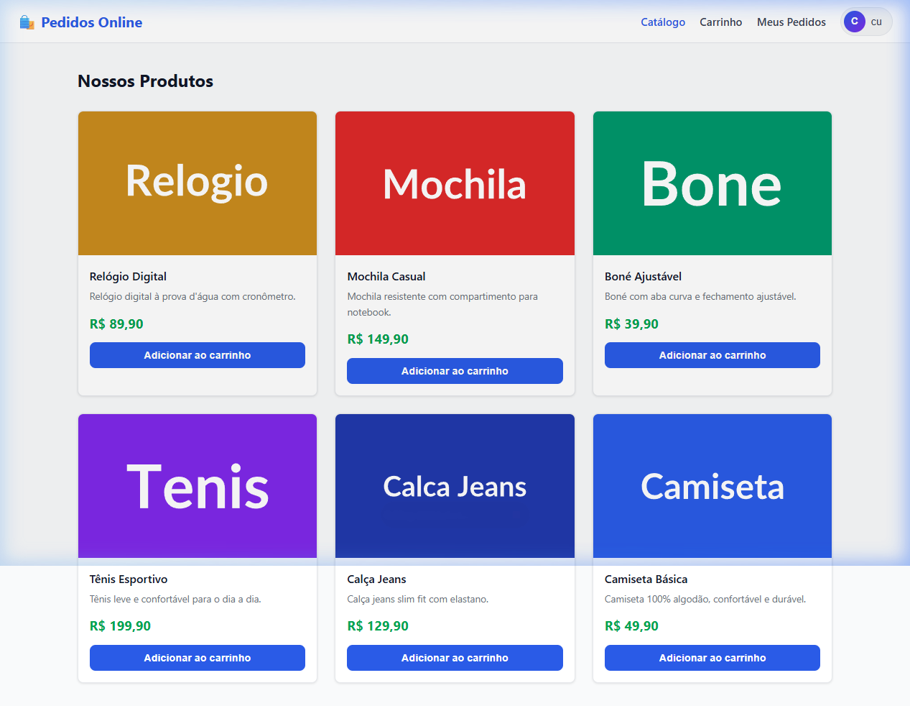
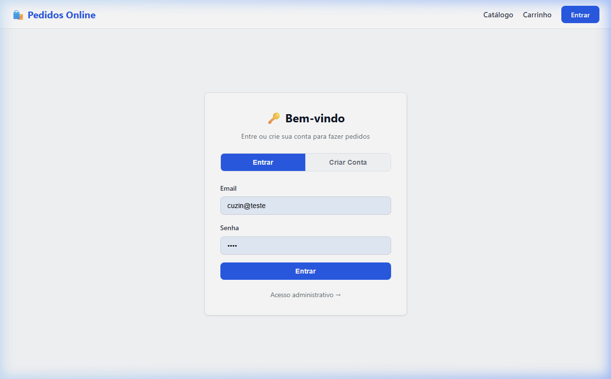
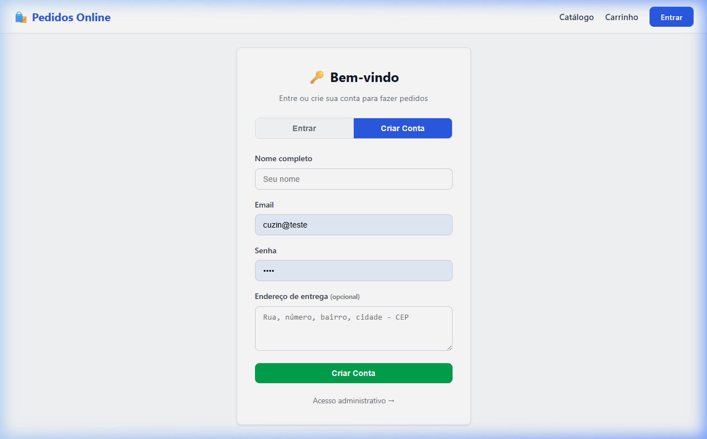
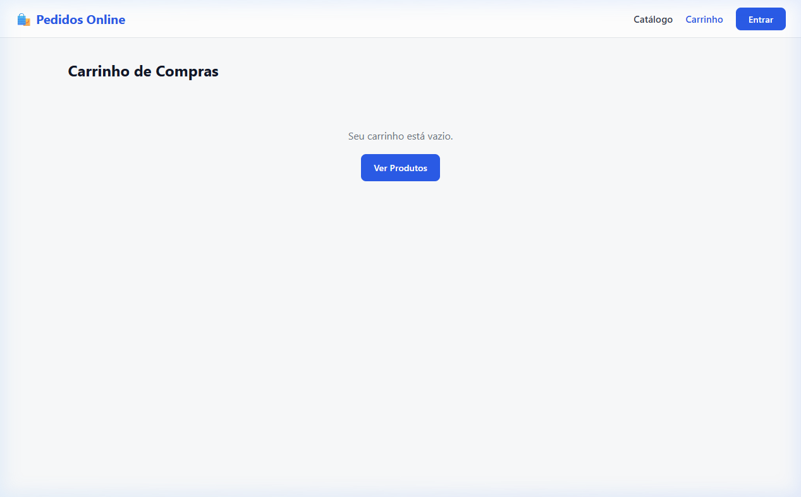
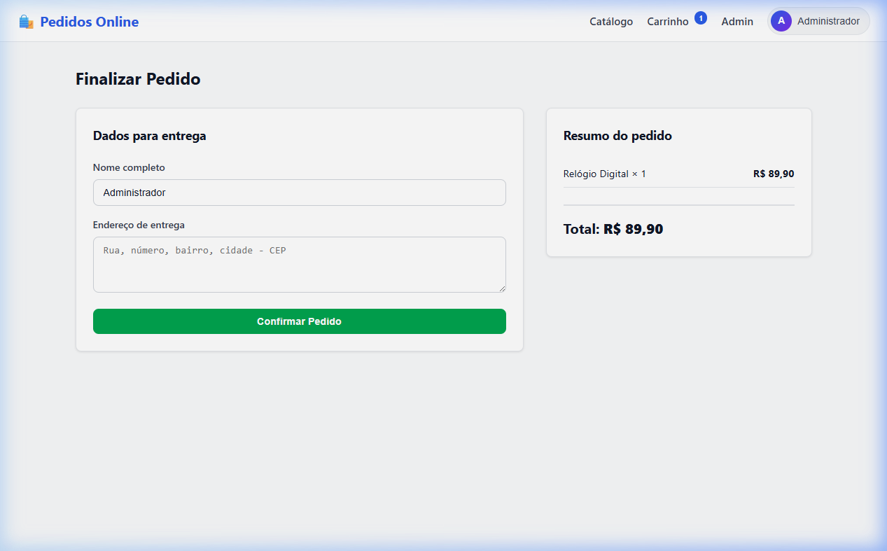
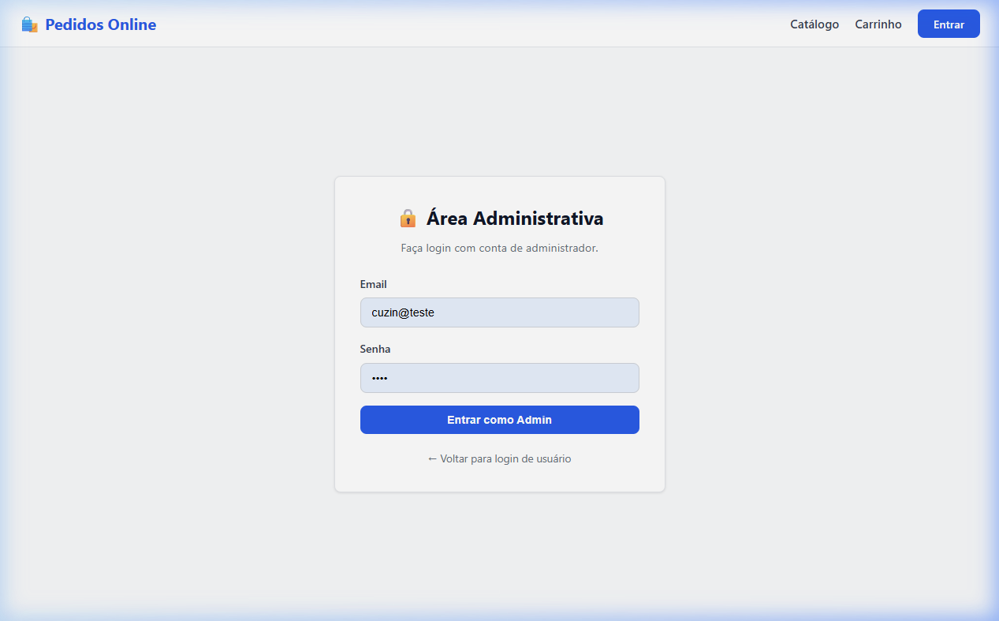
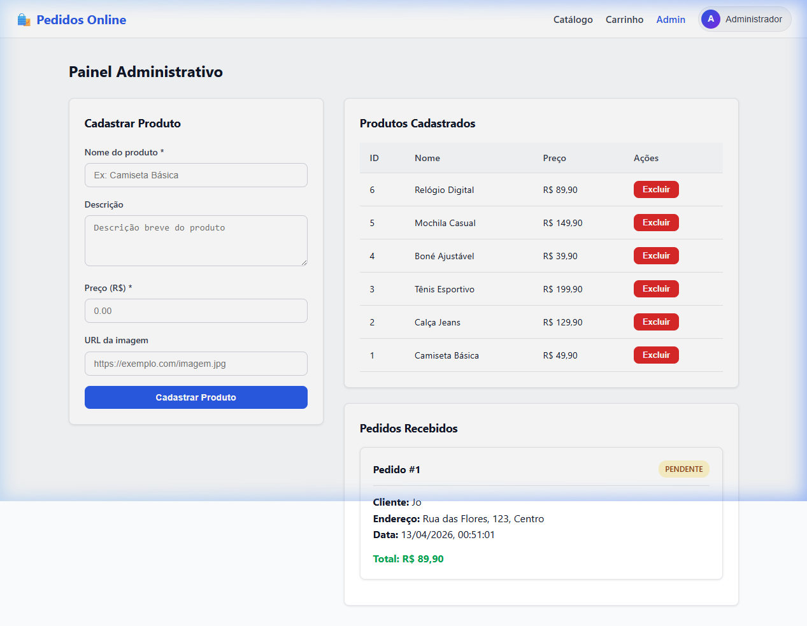

# 🛍️ Pedidos Online — Sistema Web de Pedidos

> **Disciplina:** Engenharia de Software  
> **Metodologia Ágil:** Scrum  
> **Status:** ✅ Concluído

---

## 📋 Sumário

- [Sobre o Projeto](#-sobre-o-projeto)
- [Integrantes do Grupo e Definição de Papéis](#-integrantes-do-grupo-e-definição-de-papéis)
- [Tecnologias Utilizadas](#-tecnologias-utilizadas)
- [Arquitetura do Sistema](#-arquitetura-do-sistema)
- [Funcionalidades Implementadas](#-funcionalidades-implementadas)
- [Critérios de Aceitação](#-critérios-de-aceitação)
- [Demonstração da Solução](#-demonstração-da-solução)
- [Evolução do Produto por Sprints](#-evolução-do-produto-por-sprints)
- [Como Executar o Projeto](#-como-executar-o-projeto)

---

## 📖 Sobre o Projeto

O **Pedidos Online** é uma aplicação web completa de e-commerce que permite aos clientes navegar por um catálogo de produtos, adicionar itens ao carrinho, realizar pedidos e acompanhar o status de suas compras. O sistema conta com autenticação de usuários, controle de acesso baseado em papéis (usuário e administrador) e um painel administrativo para gerenciamento de produtos e pedidos.

O projeto foi desenvolvido seguindo a metodologia ágil **Scrum**, com entregas incrementais ao longo de sprints que representam a evolução do produto, desde um MVP funcional até a versão final com sistema de autenticação multiusuário.

---

## 👥 Integrantes do Grupo e Definição de Papéis

| Nome                    | Papel                   | Responsabilidades                                                                                                  |
| ----------------------- | ----------------------- | ------------------------------------------------------------------------------------------------------------------ |
| **Vinicius Ribeiro Lopes** | 🏅 Scrum Master          | Facilitação das cerimônias Scrum, remoção de impedimentos, garantia do cumprimento das práticas ágeis, organização das sprints e comunicação entre o time. |
| **Richard Ferreira**       | 📋 Product Owner (PO)    | Definição e priorização do Product Backlog, validação dos critérios de aceitação, representação das necessidades do cliente e aprovação das entregas.       |
| **Kevin**                  | 💻 Desenvolvedor          | Desenvolvimento do servidor backend (Node.js/Express), banco de dados SQLite, sistema de autenticação e APIs REST.                                          |
| **Ricardo Gabriel**        | 💻 Desenvolvedor          | Desenvolvimento das interfaces frontend (HTML/CSS/JS), telas de catálogo, carrinho, checkout e painel administrativo.                                        |
| **Gustavo Felix**          | 💻 Desenvolvedor          | Desenvolvimento das funcionalidades de login/registro de usuários, lógica do carrinho, tela de meus pedidos e testes do sistema.                             |

---

## 🛠️ Tecnologias Utilizadas

| Camada       | Tecnologia                        | Descrição                                       |
| ------------ | --------------------------------- | ----------------------------------------------- |
| **Backend**  | Node.js + Express.js              | Servidor HTTP e API REST                        |
| **Banco**    | SQLite (via sql.js)               | Banco de dados relacional embarcado              |
| **Frontend** | HTML5, CSS3, JavaScript (Vanilla) | Interface do usuário responsiva e interativa     |
| **Auth**     | SHA-256 + Token (in-memory Map)   | Autenticação e controle de sessão                |
| **Extras**   | CORS, LocalStorage                | Comunicação cross-origin e persistência local    |

---

## 🏗️ Arquitetura do Sistema

```
pedidos-online/
├── server.js              # Servidor Express (rotas API + middleware de autenticação)
├── database.js            # Configuração do SQLite, tabelas e helpers de consulta
├── package.json           # Dependências do projeto (express, sql.js, cors)
├── pedidos.db             # Arquivo do banco de dados SQLite
│
└── public/                # Arquivos estáticos (frontend)
    ├── index.html          # Catálogo de produtos (página inicial)
    ├── cart.html           # Carrinho de compras
    ├── checkout.html       # Finalização do pedido
    ├── login.html          # Login e registro de usuários
    ├── meus-pedidos.html   # Histórico de pedidos do usuário
    ├── admin-login.html    # Login administrativo
    ├── admin.html          # Painel administrativo
    │
    ├── css/
    │   └── style.css       # Estilos globais do sistema
    │
    └── js/
        ├── auth.js         # Módulo de autenticação frontend
        ├── cart-utils.js   # Utilitários do carrinho (localStorage)
        ├── catalog.js      # Lógica do catálogo de produtos
        ├── cart.js          # Lógica da página do carrinho
        ├── checkout.js     # Lógica da finalização de pedido
        ├── meus-pedidos.js # Lógica da página "Meus Pedidos"
        └── admin.js        # Lógica do painel administrativo
```

### Diagrama de Relacionamento do Banco de Dados

```
┌────────────────┐       ┌──────────────────┐       ┌─────────────────┐
│   usuarios     │       │     pedidos      │       │    produtos     │
├────────────────┤       ├──────────────────┤       ├─────────────────┤
│ id (PK)        │──┐    │ id (PK)          │    ┌──│ id (PK)         │
│ nome           │  │    │ cliente_nome     │    │  │ nome            │
│ email (UNIQUE) │  └───>│ usuario_id (FK)  │    │  │ descricao       │
│ senha (hash)   │       │ cliente_endereco │    │  │ preco           │
│ endereco       │       │ total            │    │  │ imagem_url      │
│ role           │       │ status           │    │  │ criado_em       │
│ criado_em      │       │ criado_em        │    │  └─────────────────┘
└────────────────┘       └──────┬───────────┘    │
                                │                │
                         ┌──────┴───────────┐    │
                         │  pedido_itens    │    │
                         ├──────────────────┤    │
                         │ id (PK)          │    │
                         │ pedido_id (FK)   │    │
                         │ produto_id (FK) ─┘────┘
                         │ quantidade       │
                         │ preco_unitario   │
                         └──────────────────┘
```

---

## ✨ Funcionalidades Implementadas

### 🛒 Para o Cliente (Usuário)
- **Catálogo de Produtos** — Visualização de todos os produtos disponíveis com imagem, descrição e preço
- **Carrinho de Compras** — Adição, remoção e alteração de quantidade de itens (persistido via localStorage)
- **Registro de Conta** — Criação de conta com nome, email, senha e endereço
- **Login / Logout** — Autenticação segura com token
- **Checkout** — Finalização de pedido com dados pré-preenchidos do perfil
- **Meus Pedidos** — Histórico completo de pedidos com status e itens detalhados
- **Navbar Dinâmica** — Menu de navegação adaptável ao estado de login, com avatar e dropdown do perfil

### ⚙️ Para o Administrador
- **Login Administrativo** — Acesso exclusivo ao painel admin com verificação de role
- **Cadastro de Produtos** — Formulário para adicionar novos produtos com nome, descrição, preço e imagem
- **Listagem de Produtos** — Tabela com todos os produtos cadastrados e opção de exclusão
- **Gerenciamento de Pedidos** — Visualização de todos os pedidos recebidos com detalhes do cliente, itens e total

### 🔒 Segurança
- **Hashing de Senhas** — Senhas armazenadas com SHA-256
- **Autenticação via Token** — Tokens aleatórios de 32 bytes com gerenciamento em memória
- **Middleware de Autorização** — Proteção de rotas sensíveis (admin e usuário)
- **Controle de Acesso** — Diferenciação de permissões entre `user` e `admin`

---

## ✅ Critérios de Aceitação

### US01 — Catálogo de Produtos
| # | Critério | Condição de Aceite |
|---|----------|-------------------|
| 1 | Listagem de produtos | Ao acessar a página inicial, todos os produtos cadastrados devem ser exibidos em formato de grid com imagem, nome, descrição e preço. |
| 2 | Estado vazio | Quando não houver produtos cadastrados, deve ser exibida a mensagem "Nenhum produto disponível no momento." |
| 3 | Botão de adicionar | Cada produto deve possuir o botão "Adicionar ao carrinho" que, ao ser clicado, adiciona o item e exibe feedback visual de confirmação ("✓ Adicionado"). |
| 4 | Atualização do badge | O número no badge do carrinho (navbar) deve ser atualizado automaticamente ao adicionar um produto. |

### US02 — Carrinho de Compras
| # | Critério | Condição de Aceite |
|---|----------|-------------------|
| 1 | Exibição dos itens | O carrinho deve exibir a lista de todos os itens adicionados com imagem, nome, preço e quantidade. |
| 2 | Alteração de quantidade | O usuário deve poder aumentar (+) ou diminuir (−) a quantidade de cada item. Se a quantidade chegar a zero, o item é removido automaticamente. |
| 3 | Remoção de item | O botão "Remover" deve excluir o item do carrinho e exibir mensagem de confirmação. |
| 4 | Cálculo do total | O total do carrinho deve ser recalculado automaticamente após qualquer alteração. |
| 5 | Carrinho vazio | Quando vazio, deve exibir "Seu carrinho está vazio." com botão para voltar ao catálogo. |
| 6 | Persistência | Os itens do carrinho devem persistir ao recarregar a página (localStorage) e ser separados por usuário. |

### US03 — Registro de Usuário
| # | Critério | Condição de Aceite |
|---|----------|-------------------|
| 1 | Campos obrigatórios | Nome, email e senha são obrigatórios; endereço é opcional. |
| 2 | Validação de senha | A senha deve possuir no mínimo 4 caracteres. |
| 3 | Email único | O sistema deve rejeitar o cadastro se o email já estiver registrado, retornando "Este email já está cadastrado." |
| 4 | Login automático | Após registro bem-sucedido, o usuário deve ser autenticado automaticamente e redirecionado. |

### US04 — Login / Logout
| # | Critério | Condição de Aceite |
|---|----------|-------------------|
| 1 | Autenticação | Email e senha válidos devem gerar um token de sessão e redirecionar o usuário. |
| 2 | Credenciais inválidas | Deve retornar a mensagem "Email ou senha incorretos." sem revelar qual campo está errado. |
| 3 | Navbar atualizada | Após login, a navbar deve exibir o avatar do usuário, nome e opções contextuais (Meus Pedidos / Admin / Sair). |
| 4 | Logout | Ao clicar em "Sair", o token deve ser invalidado no servidor, os dados locais limpos e o usuário redirecionado à página inicial. |

### US05 — Finalização de Pedido (Checkout)
| # | Critério | Condição de Aceite |
|---|----------|-------------------|
| 1 | Login obrigatório | Se o usuário não estiver logado, deve ser exibida mensagem "Login Necessário" com link para a tela de login. |
| 2 | Pré-preenchimento | Os campos de nome e endereço devem ser pré-preenchidos com os dados do perfil do usuário logado. |
| 3 | Resumo do pedido | Todos os itens do carrinho devem ser listados no resumo com subtotal por item e total geral. |
| 4 | Confirmação | Após submissão bem-sucedida, o carrinho é esvaziado e a mensagem "Pedido Confirmado!" é exibida com o número do pedido. |
| 5 | Validação | Nome e endereço de entrega são campos obrigatórios para finalizar o pedido. |

### US06 — Meus Pedidos
| # | Critério | Condição de Aceite |
|---|----------|-------------------|
| 1 | Acesso restrito | Apenas usuários autenticados podem acessar esta página; caso contrário, redirecionar para login. |
| 2 | Listagem pessoal | Somente os pedidos do usuário logado devem ser exibidos, ordenados do mais recente para o mais antigo. |
| 3 | Detalhes completos | Cada pedido deve mostrar: número (#id), data de criação, status (pill colorido), lista de itens e total. |
| 4 | Estado vazio | Se o usuário não tiver pedidos, exibir "Você ainda não fez nenhum pedido." com botão para ir ao catálogo. |

### US07 — Painel Administrativo
| # | Critério | Condição de Aceite |
|---|----------|-------------------|
| 1 | Acesso exclusivo | Apenas usuários com role `admin` podem acessar o painel; se não for admin, redirecionar para login admin ou página inicial. |
| 2 | Cadastro de produto | O formulário deve exigir nome e preço (obrigatórios) e aceitar descrição e URL de imagem (opcionais). Preço deve ser positivo. |
| 3 | Listagem de produtos | Todos os produtos cadastrados devem ser exibidos em tabela com ID, nome, preço e botão de exclusão. |
| 4 | Exclusão de produto | Ao clicar em "Excluir", deve ser exibida confirmação antes da exclusão definitiva. |
| 5 | Listagem de pedidos | Todos os pedidos de todos os clientes devem ser exibidos com nome do cliente, endereço, data, itens e total. |

---

## 🖥️ Demonstração da Solução

### 1. Catálogo de Produtos (Página Inicial)
Tela principal do sistema exibindo o grid de produtos com imagens, descrições, preços e botão de adicionar ao carrinho.



---

### 2. Tela de Login
Sistema de autenticação com abas para alternar entre **Entrar** (login) e **Criar Conta** (registro), com link para acesso administrativo.



---

### 3. Tela de Registro
Formulário de criação de conta com campos para nome, email, senha e endereço de entrega (opcional).



---

### 4. Carrinho de Compras
Página do carrinho exibindo os itens adicionados, controladores de quantidade, opção de remoção e totalizador.



---

### 5. Finalização de Pedido (Checkout)
Tela de checkout com formulário de dados para entrega (nome e endereço pré-preenchidos) e resumo completo do pedido.



---

### 6. Login Administrativo
Tela de login exclusiva para acesso ao painel de administração com validação de role.



---

### 7. Painel Administrativo
Painel completo do administrador com formulário de cadastro de produto, tabela de produtos e lista de pedidos recebidos.



---

## 📈 Evolução do Produto por Sprints

### Sprint 1 — MVP (Produto Mínimo Viável)
**Objetivo:** Criar a base funcional do sistema de e-commerce.

| Entrega | Descrição |
|---------|-----------|
| Catálogo de Produtos | Grid responsivo exibindo produtos da API com imagens e preços |
| Carrinho de Compras | Adicionar/remover itens com persistência em localStorage |
| Checkout Simples | Formulário de finalização com envio do pedido via API |
| Painel Admin (básico) | Cadastro e exclusão de produtos + visualização de pedidos |
| API REST Backend | Servidor Express com rotas CRUD para produtos e pedidos |
| Banco de Dados | SQLite com tabelas de produtos, pedidos e pedido_itens |

### Sprint 2 — Autenticação e Multiusuário
**Objetivo:** Implementar o sistema completo de autenticação e transformar o sistema em plataforma multiusuário.

| Entrega | Descrição |
|---------|-----------|
| Registro de Usuários | Criação de conta com nome, email, senha (hash SHA-256) e endereço |
| Login Unificado | Sistema de login unificado para usuários comuns e administradores |
| Controle de Sessão | Tokens aleatórios gerenciados em memória com verificação de validade |
| Middleware de Autenticação | Proteção de rotas com `authMiddleware` e `adminMiddleware` |
| Navbar Dinâmica | Menu adaptável ao estado de autenticação com avatar, dropdown e opções por role |
| Meus Pedidos | Tela exclusiva para o usuário acompanhar o histórico de pedidos pessoais |
| Carrinho por Usuário | Separação do carrinho por usuário logado (localStorage com chave individual) |
| Login Admin Separado | Tela específica de login para administradores com verificação de permissão |
| Checkout com Auth | Exigência de login para finalizar pedido + dados pré-preenchidos do perfil |

### Sprint 3 — Polimento e Entrega Final
**Objetivo:** Refinamentos de interface, validações extras e documentação.

| Entrega | Descrição |
|---------|-----------|
| UI/UX Aprimorada | Cards modernos, badges de status, loading spinners, estados vazios com ícones |
| Validações Robustas | Verificação de token no servidor, tratamento de erros, feedback visual ao usuário |
| Segurança Reforçada | Tratamento de sessão expirada, limpeza de dados ao deslogar, proteção CORS |
| Responsividade | Layout adaptável para desktop e dispositivos móveis |
| Documentação | README completo com critérios de aceitação, demonstração e papéis da equipe |

---

## 🚀 Como Executar o Projeto

### Pré-requisitos
- [Node.js](https://nodejs.org/) (versão 16 ou superior)

### Instalação

```bash
# 1. Clone ou extraia o projeto
cd pedidos-online

# 2. Instale as dependências
npm install

# 3. Inicie o servidor
npm start
```

### Acessando o Sistema

| Página | URL |
|--------|-----|
| 📦 **Catálogo** | http://localhost:3000 |
| 🛒 **Carrinho** | http://localhost:3000/cart.html |
| 📋 **Checkout** | http://localhost:3000/checkout.html |
| 🔑 **Login** | http://localhost:3000/login.html |
| 📦 **Meus Pedidos** | http://localhost:3000/meus-pedidos.html |
| 🔒 **Login Admin** | http://localhost:3000/admin-login.html |
| ⚙️ **Painel Admin** | http://localhost:3000/admin.html |

### Credenciais Padrão do Administrador

```
Email: admin@admin.com
Senha: admin123
```

---

> **Projeto desenvolvido para fins acadêmicos na disciplina de Engenharia de Software.**
